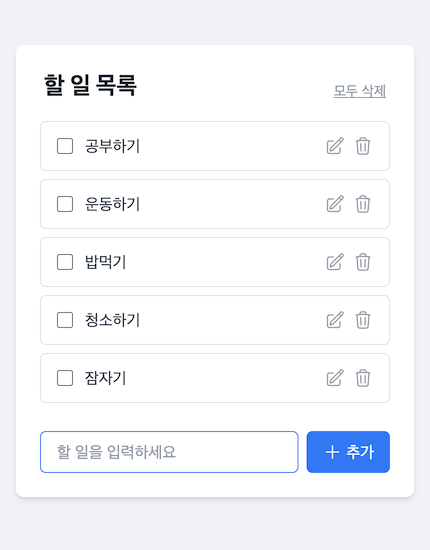

# 📝 To-do App (Full-stack Mission)

Node.js와 React를 사용하여 제작한 풀스택 할 일 관리 애플리케이션입니다.  
기본적인 CRUD 기능에 더해 사용자 편의를 위한 순서 변경(Drag & Drop) 및 다중 삭제 기능을 포함하고 있습니다.

## ✨ 주요 개선 사항 (Highlights)

- **DND 라이브러리 교체**: Deprecated된 `react-beautiful-dnd`를 대신하여 최신 유지보수 버전인 **`@hello-pangea/dnd`**를 적용해 안정성을 높였습니다.
- **UX 편의성 강화**: 할 일 추가(`CreateForm`) 및 수정(`TodoItem`) 중 **`ESC` 키**를 눌러 즉시 입력을 취소할 수 있는 단축키 기능을 추가했습니다.
- **개발 생산성 향상**: 백엔드에 **Seed 스크립트**를 추가하여 초기 개발 환경 세팅 시 테스트 데이터를 즉시 생성할 수 있습니다.
- **고급 API 구현**: 단순 CRUD를 넘어 서버 사이드 순서 변경(Reorder) 및 다중 삭제(Bulk Delete) API를 직접 설계하고 구현했습니다.
- **데이터 매핑 최적화**: Axios 인터셉터를 사용하여 MongoDB의 `_id`를 프론트엔드 전반에서 일관되게 사용할 수 있도록 `id` 필드로 자동 변환하여 코드 가독성을 높였습니다.

---

## 📸 작동 화면



---

## 🚀 주요 기능

### Backend

- **RESTful API**: Express 기반의 할 일 관리 API.
- **순서 변경 (Reorder)**: `PATCH /api/todos/reorder`를 통해 할 일의 우선순위를 서버에 저장.
- **다중 삭제 (Multi-delete)**: 여러 항목을 한 번에 삭제할 수 있는 API 구현.
- **데이터 시딩 (Seeding)**: `npm run seed` 스크립트를 통해 초기 테스트 데이터 자동 생성.
- **API 문서화**: Swagger(OpenAPI 3.0)를 적용하여 `/api-docs`에서 인터랙티브한 문서 제공.
- **테스트 자동화**: Jest와 Supertest를 이용한 주요 API 엔드포인트 테스트 케이스 작성.

### Frontend

- **현대적인 UI/UX**: CRA(Create React App) 기반에 Tailwind CSS를 활용한 간결하고 은은한 디자인.
- **아이콘 시스템**: Heroicons를 사용하여 버튼 텍스트 대신 직관적인 아이콘 UI 제공.
- **서버 연동**: Axios를 사용하며, 인터셉터를 통해 MongoDB의 `_id`를 프론트엔드에서 사용하기 편하도록 `id`로 변환 처리.
- **에러 핸들링**: 서버 응답 실패 시 사용자에게 알림을 제공하는 예외 처리 로직 포함.
- **드래그 앤 드롭**: `@hello-pangea/dnd`를 사용하여 할 일 순서를 직관적으로 변경 (react-beautiful-dnd 대체).
- **단축키 지원**: 입력 및 수정 모드에서 `ESC` 키를 통한 취소 기능 지원.

---

## 🛠 기술 스택

**Backend:**

- **Runtime**: Node.js
- **Framework**: Express
- **Database**: MongoDB
- **ODM**: Mongoose
- **Documentation**: Swagger UI
- **Testing**: Jest, Supertest

**Frontend:**

- **Library**: React
- **Styling**: Tailwind CSS, Heroicons
- **HTTP Client**: Axios
- **Drag & Drop**: @hello-pangea/dnd

---

## ⚙️ 설치 및 실행

### 환경 변수 설정 (.env)

**Backend (`/backend/.env`)**

```env
PORT=4000
MONGO_URI=your_mongodb_connection_string
```

**Frontend (`/frontend/.env`)**

```env
REACT_APP_SERVER_URL=http://localhost:4000/api
```

### 실행 방법

> ⚠️ **중요**: 백엔드 실행을 위해 연결 가능한 MongoDB 인스턴스(Local 또는 Atlas)가 필요합니다. `.env` 파일의 `MONGO_URI`가 본인의 환경에 맞게 설정되었는지 확인해주세요.

1. **Backend**

   ```bash
   cd backend
   npm install
   npm run seed # 초기 데이터 생성이 필요한 경우
   npm start
   ```

2. **Frontend**

   ```bash
   cd frontend
   npm install
   npm start
   ```
